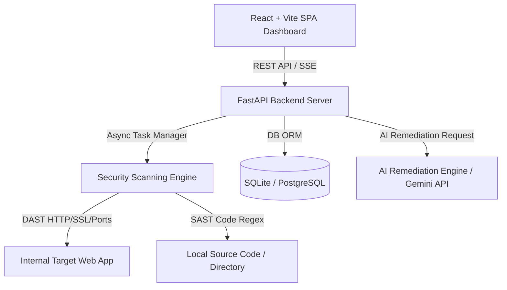

# SiteCure — Internal Web Vulnerability Scanner & Security Remediation Platform
## Blueprint & Architectural Specification

---

## 1. Overview & Understanding Summary
**SiteCure** adalah aplikasi pemindai kerentanan keamanan website internal berkelas enterprise yang dirancang untuk mengidentifikasi celah keamanan secara dinamis (DAST) dan statis (SAST Light), memberikan skor risiko CVSS 3.1, menyajikan rekomendasi penambalan berbasis AI (*AI Code Remediation Patch*), serta menyediakan fitur verifikasi ulang (*One-Click Rescan*).

### Key Features
- **Asset Management:** Pengelolaan daftar target website/IP/Repositori internal.
- **Dual-Engine Security Scanner:**
  - **DAST Module:** HTTP probe & security headers audit, SSL/TLS inspector, OWASP Top 10 fuzzer (SQLi, XSS, CSRF, Path Traversal, Misconfigurations), dan open port scanner.
  - **SAST Light Module:** Source code scanner untuk kebocoran API Keys/Secrets, Hardcoded Passwords, serta matching CVE dependensi.
- **Interactive Vulnerability Matrix:** Tampilan temuan dengan pengelompokan severity (Critical, High, Medium, Low, Info) & kalkulator CVSS 3.1.
- **AI Remediation & Code Patch Generator:** Generasi kode perbaikan (*diff snippet*) berbasis AI untuk mempermudah penambalan oleh developer.
- **One-Click Rescan Verification:** Pengujian ulang instan khusus pada endpoint yang rentan untuk memverifikasi efektivitas penambalan.
- **Executive PDF & JSON Reporting:** Ekspor laporan audit keamanan profesional.

---

## 2. Technical Architecture & Stack

### Component Breakdown
1. **Frontend Dashboard (`frontend/`)**:
   - **Framework:** React 19 + Vite
   - **Styling:** Tailwind CSS v4 + Lucide React Icons
   - **State & Data Fetching:** React Query / Axios + Server-Sent Events (SSE) untuk real-time scan logs.
   - **Visualizations:** Recharts / Lucide badges untuk visualisasi severity & CVSS scores.

2. **Backend Security Server (`backend/`)**:
   - **Framework:** Python 3.12+ dengan FastAPI
   - **Database:** SQLite (default) dengan SQLAlchemy 2.0 ORM & Pydantic v2 schemas
   - **Task Processing:** Async background scanner engine (FastAPI BackgroundTasks / Asyncio workers)
   - **Security Scanner Modules (`backend/app/scanner/`)**:
     - `dast_http.py`: Audit HTTP Headers (HSTS, CSP, X-Frame-Options, CORS), SSL/TLS, Fuzzing SQLi/XSS/Path Traversal.
     - `dast_ports.py`: Fast TCP port scanner untuk mengidentifikasi service sensitif yang terbuka.
     - `sast_code.py`: Pattern matcher regex AST untuk secrets leak, vulnerable patterns, & CVE lookups.
   - **AI Remediation Service (`backend/app/services/ai_remediation.py`)**:
     - Memproses prompt kerentanan + snippet kode rentan ke AI (Gemini LLM) untuk menghasilkan patch perbaikan (*diff*).

---

## 3. Skill Orchestration Plan (`vibes-plug`)

| Layer / Subsystem | Skill Delegasi | Tanggung Jawab Utama |
| :--- | :--- | :--- |
| **Backend & Engine** | `python-programming-expert` | Membangun FastAPI routes, async DAST/SAST scanner modules, Pydantic v2 data validation, & database models. |
| **Frontend & UI/UX** | `senior-frontend`, `tailwind-expert` | Membangun SPA React + Vite, dashboard layout glassmorphism, real-time scan progress stream, & UI diff patch viewer. |
| **AI Patch Generator** | `ai-llm-integration-expert` | Mendesain prompt template presisi untuk rekomendasi penambalan celah keamanan & sintaks perbaikan kode. |
| **Testing & Quality** | `e2e-testing-expert`, `secure-fuzz-testing` | Membuat unit test untuk endpoint API FastAPI & validasi modul scanner agar bebas dari false-positive ekstrem. |
| **Orchestration Handoff** | `zero-to-prod-orchestrator`, `auto-doc-updater` | Menjalankan pipeline pembangunan bertahap & memperbarui dokumen siklus pengembangan. |

---

## 4. Database Schema (Entity Relationship)

- **TargetAsset**: `id`, `name`, `target_url`, `asset_type` (web/repo), `environment` (dev/staging/internal), `created_at`
- **ScanJob**: `id`, `target_id`, `status` (pending/running/completed/failed), `scan_type` (full/dast/sast), `progress_pct`, `started_at`, `completed_at`
- **Vulnerability**: `id`, `scan_job_id`, `title`, `description`, `severity` (CRITICAL/HIGH/MEDIUM/LOW/INFO), `cvss_score`, `cwe_id`, `affected_endpoint`, `remediation_guide`, `is_remediated`, `created_at`
- **RemediationPatch**: `id`, `vulnerability_id`, `original_code`, `patched_code`, `diff_text`, `ai_explanation`, `created_at`

---

## 5. Decision Log

| # | Keputusan | Alternatif Dipertimbangkan | Rasional & Prinsip Keamanan |
|---|-----------|---------------------------|----------------------------------|
| 1 | **FastAPI + Async Python Engine** | Node.js Express / Go Microservice | Python sangat kaya library analisis keamanan, parsing HTTP, regex matcher, & kemudahan integrasi AI LLM SDK. |
| 2 | **Safe DAST Fuzzing Payloads** | Aggressive Exploitation Tools | Pemindaian ditujukan untuk website internal; payload dirancang aman (*non-destructive*) tanpa merusak data/database produksi. |
| 3 | **AI Code Patch Generator** | Template Statis Manual | Pengembang membutuhkan solusi konkret berupa perbaikan kode spesifik (*context-aware patch*) bukan sekadar definisi teori kerentanan. |
| 4 | **React + Vite + SSE** | Polling Interval / WebSockets | SSE (Server-Sent Events) sangat efisien & simpel untuk streaming logs & progress scan 1 arah dari backend ke frontend. |

---

## 6. Risk Assessment & Mitigation
- **False Positives:** Implementasi scoring confidence (High/Medium/Low Confidence) pada setiap temuan kerentanan.
- **Resource Exhaustion Saat Scan:** Pembatasan concurrency request (rate limiter) pada DAST engine agar tidak membebankan target server internal.
- **Keamanan Data Internal:** Kunci API LLM disimpang secara aman dalam `.env` lokal tanpa mengekspos source code target ke publik.
