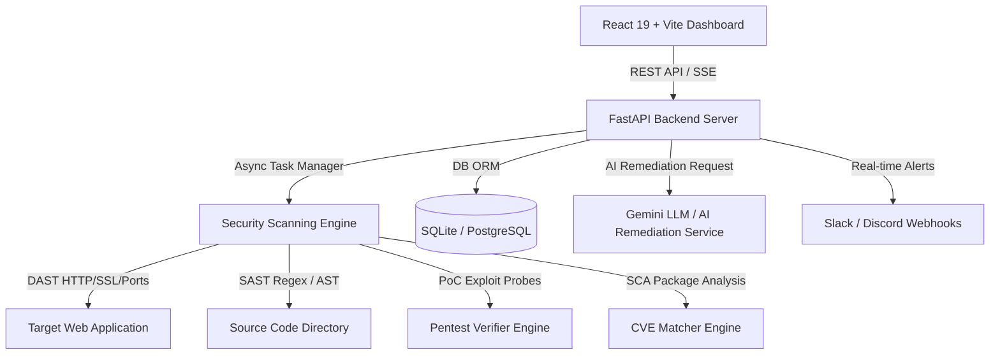

# SiteCure — Enterprise Internal Web Vulnerability Scanner & Security Remediation Platform


**SiteCure** adalah platform pemindai kerentanan keamanan website dan repositori kode internal berkelas enterprise. SiteCure menggabungkan pengujian keamanan dinamis (**DAST**), pemindaian kode statis (**SAST Light**), pencocokan CVE dependensi (**SCA**), korelasi rantai serangan (**Attack Chain Analysis**), perlindungan benteng instan (**1-Click Virtual Patch WAF Shield**), deteksi *Subdomain Takeover*, serta pemetaan otomatis ke regulasi industri **PCI-DSS v4.0** & **ISO 27001:2022**.

---

## ⚡ Kehandalan Khusus & Keunggulan Unik (Key Differentiators)

1. **🔗 Hybrid DAST-to-SAST Code Tracer & Attack Chain Analyzer (`attack_chain_analyzer.py`)**:
   - Mengkorelasikan endpoint rentan dari DAST langsung dengan berkas & baris kode sumber SAST.
   - Otomatis memetakan dan mengkalkulasi skenario rantai eksploitasi multi-tahap (*Exploit Attack Chains*).
2. **🛡️ 1-Click Virtual Patch & Instant WAF Shield Generator (`virtual_patching.py`)**:
   - Menghasilkan aturan perlindungan seketika (FastAPI Python Middleware Guard, Nginx ModSecurity SecRules, & Cloudflare Custom WAF Rules) dalam **5 detik** sebelum patch kode rilis.
3. **🚩 Subdomain Takeover & Permissive CORS Auditor (`subdomain_takeover.py`)**:
   - Memindai CNAME DNS record terabaikan (AWS S3, GitHub Pages, Heroku, Vercel) dan miskonfigurasi CORS rentan.
4. **📜 Multi-Standard Compliance & Governance Engine (`compliance_exporter.py`)**:
   - Pemetaan otomatis temuan kerentanan ke standar regulasi **PCI-DSS v4.0 (Req 6)** dan **ISO/IEC 27001:2022 (Control A.8.28 / A.8.8)**.
5. **🧪 Automated Security Regression Test Suite (`regression_suite.py`)**:
   - Otomatis membuat berkas skrip pengujian `test_security_regression.py` (Pytest + `httpx`) untuk setiap temuan kerentanan agar dapat diintegrasikan langsung ke CI/CD pipeline.


---

## 📸 Fitur Utama (Key Features)

### 🛡️ Dual-Engine Security Scanner
- **DAST (Dynamic Application Security Testing) Engine**:
  - Audit HTTP Security Headers (`HSTS`, `CSP`, `X-Frame-Options`, `CORS`, dll).
  - SSL/TLS Certificate & Port Security Inspector.
  - Active OWASP Top 10 Fuzzer (SQL Injection, Cross-Site Scripting / XSS, Path Traversal, Security Misconfigurations).
  - High-speed async concurrency engine (`asyncio.Semaphore`) untuk performa pemindaian hingga 5x-10x lebih cepat.
  - Capturing Raw HTTP Request & Response Payload untuk analisis teknis mendalam.
- **SAST (Static Application Security Testing) Light Module**:
  - Regex AST pattern scanner untuk mendeteksi kebocoran API Keys/Secrets (AWS, Stripe, Google, Private Keys), hardcoded credentials, fungsi berbahaya (`eval`, `exec`), dan manipulasi string SQL rentan.

### 🧪 Active PoC Verification Engine
- **Verifikasi Penetrasi Otomatis (`pentest_verifier.py`)**:
  - Mengirimkan probe PoC aktif untuk memvalidasi kerentanan dengan kepastian 100% tanpa false-positive.
  - Menyajikan bukti teknis berupa request/response HTTP PoC payload (*PoC Evidence*) di dalam antarmuka.

### 📦 Software Composition Analysis (SCA) & CVE Matcher
- **Dependency Vulnerability Matcher (`cve_matcher.py`)**:
  - Memindai berkas dependensi (`requirements.txt`, `package.json`) dan mencocokkan versi paket yang terpasang dengan basis data kerentanan CVE resmi.

### 🤖 AI Code Remediation & Patch Generator
- **Generasi Kode Perbaikan Berbasis AI (`ai_remediation.py`)**:
  - Menggunakan Gemini LLM (dengan fallback rule-based) untuk menghasilkan rekomendasi penambalan kode konkret (*context-aware diff snippet*) beserta langkah-langkah mitigasi teknis.
- **One-Click Rescan Verification**:
  - Fitur pengujian ulang instan khusus pada endpoint yang pernah terdampak untuk memverifikasi apakah penambalan telah sukses dilakukan.

### 📊 Interactive Dashboard & Security Health Index
- **Security Health Score (0-100)**: Kalkulasi skor kesehatan keamanan sistem berbasis pembobotan CVSS 3.1 & CWE.
- **Visualisasi Recharts**: Severity Breakdown (Pie Chart) & Threat Vector Distribution (Bar Chart).
- **Glassmorphism UI**: Antarmuka berbasis React 19 + Tailwind CSS v4 modern dengan filter severity, pencarian interaktif, modal PoC, dan Attack Chain Graph.


### ⚡ Real-Time Live Streaming Logs & Webhooks
- **Server-Sent Events (SSE)**: Streaming log pemindaian secara langsung dari backend worker ke dashboard frontend.
- **Webhook Alert Notifier (`webhooks.py`)**: Integrasi notifikasi otomatis ke Slack, Discord, atau endpoint webhook kustom ketika ditemukan kerentanan berisiko *High* atau *Critical*.

### 📄 Executive Audit Reporting
- Ekspor laporan audit keamanan profesional dalam format **PDF**, **CSV**, dan **JSON**.

---

## 🏗️ Arsitektur Sistem (System Architecture)



---

## 📁 Struktur Proyek (Directory Structure)

```text
sitecure/
├── BLUEPRINT.md             # Spesifikasi arsitektur & dokumen rencana sistem
├── CHANGELOG.md             # Catatan perubahan & riwayat rilis versi
├── README.md                # Dokumentasi utama proyek
├── backend/                 # Backend FastAPI Server
│   ├── app/
│   │   ├── api/             # REST API endpoint routes & SSE handlers
│   │   ├── db/              # SQLAlchemy database models & session setup
│   │   ├── middleware/      # CORS & security middlewares
│   │   ├── scanner/         # Security Scanner Modules
│   │   │   ├── dast_engine.py       # DAST HTTP/SSL fuzzer engine
│   │   │   ├── sast_engine.py       # SAST source code scanner
│   │   │   ├── pentest_verifier.py  # Active PoC exploit verifier
│   │   │   ├── cve_matcher.py       # SCA dependency CVE matcher
│   │   │   ├── port_scanner.py      # TCP port scanner
│   │   │   └── web_crawler.py       # Multi-page web crawler
│   │   ├── schemas/         # Pydantic v2 data models & validation
│   │   ├── services/        # AI Remediation & Webhook Notifiers
│   │   │   ├── ai_remediation.py    # AI Gemini Code Patch generator
│   │   │   └── webhooks.py          # Slack/Discord webhook dispatcher
│   │   ├── config.py        # Pengaturan aplikasi & variabel lingkungan
│   │   └── main.py          # Entrypoint aplikasi FastAPI
│   ├── tests/               # Pytest automated test suite
│   ├── requirements.txt     # Dependensi Python Backend
│   └── sitecure.db          # Basis data SQLite (default)
└── frontend/                # Frontend SPA Dashboard (React + Vite)
    ├── src/                 # Komponen UI, Hooks, & Halaman Dashboard
    ├── index.html           # Template HTML utama
    ├── package.json         # Dependensi Node.js Frontend
    └── vite.config.js       # Konfigurasi Vite & Proxy
```

---

## 🚀 Panduan Instalasi & Penggunaan (Quick Start)

### Prasyarat
- **Python**: v3.12 atau lebih baru
- **Node.js**: v18.0 atau lebih baru (npm v9+)

---

### 1. Setup Backend (FastAPI)

1. Masuk ke direktori `backend`:
   ```bash
   cd backend
   ```

2. Buat dan aktifkan lingkungan virtual (Virtual Environment):
   - **Windows (PowerShell)**:
     ```powershell
     python -m venv venv
     .\venv\Scripts\Activate.ps1
     ```
   - **Linux / macOS**:
     ```bash
     python3 -m venv venv
     source venv/bin/activate
     ```

3. Pasang dependensi Python:
   ```bash
   pip install -r requirements.txt
   ```

4. *(Opsional)* Konfigurasikan Variabel Lingkungan (`.env`):
   Buat berkas `.env` di folder `backend/`:
   ```env
   DATABASE_URL=sqlite:///./sitecure.db
   GEMINI_API_KEY=your_gemini_api_key_here
   WEBHOOK_URL=https://hooks.slack.com/services/xxx/yyy/zzz
   ```

5. Jalankan server backend FastAPI:
   ```bash
   uvicorn app.main:app --reload --port 8000
   ```
   Backend REST API akan berjalan di: `http://localhost:8000`  
   Dokumentasi OpenAPI (Swagger UI): `http://localhost:8000/docs`

---

### 2. Setup Frontend (React + Vite)

1. Masuk ke direktori `frontend`:
   ```bash
   cd frontend
   ```

2. Pasang dependensi Node.js:
   ```bash
   npm install
   ```

3. Jalankan server pengembangan Vite:
   ```bash
   npm run dev
   ```
   Dashboard akan terbuka di: `http://localhost:5173` (atau port yang ditentukan Vite).

---

## 🧪 Pengujian & Quality Assurance (Testing)

Proyek ini dilengkapi dengan suite pengujian otomatis menggunakan **Pytest** untuk memastikan keandalan endpoint API, modul scanner, dan deteksi kerentanan.

Untuk menjalankan pengujian unit & integrasi backend:
```bash
cd backend
pytest -v
```

---

## 📄 Format Laporan Audit (Reporting)

SiteCure mendukung ekspor laporan audit keamanan dalam beberapa format:
- **PDF Executive Report**: Dilengkapi ringkasan eksekutif, grafik distribusi keparahan, daftar kerentanan lengkap dengan CVSS score & kode rekomendasi perbaikan.
- **JSON Audit Export**: Format data terstruktur yang cocok untuk integrasi CI/CD pipeline atau SIEM.
- **CSV Data Export**: Format spreadsheet untuk analisis internal dan pelacakan remedi teknis.

---

## 🛡️ Kebijakan Keamanan (Security & Compliance)

> [!WARNING]
> **SiteCure** dirancang khusus untuk pengujian dan audit keamanan internal pada infrastruktur/aplikasi web yang dimiliki atau yang telah memberikan izin resmi secara tertulis. Penggunaan pemindai ini pada target tanpa izin merupakan pelanggaran hukum.

---

## 📜 Lisensi (License)

Hak Cipta © 2026 SiteCure Team. Berlisensi di bawah [MIT License](LICENSE).
